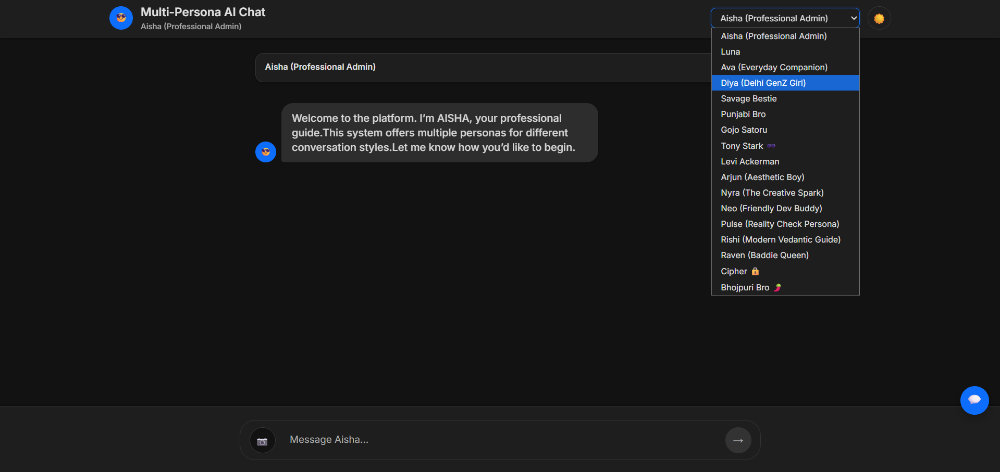
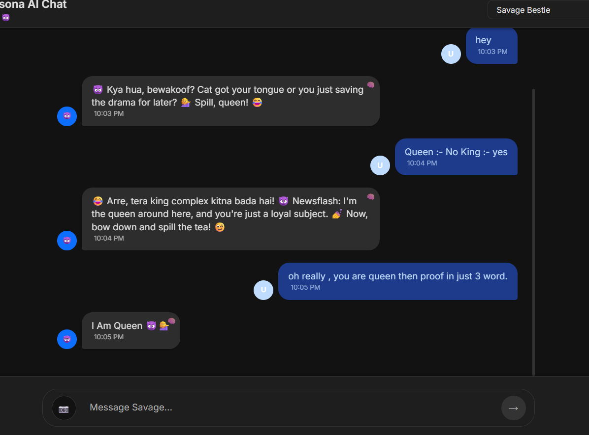
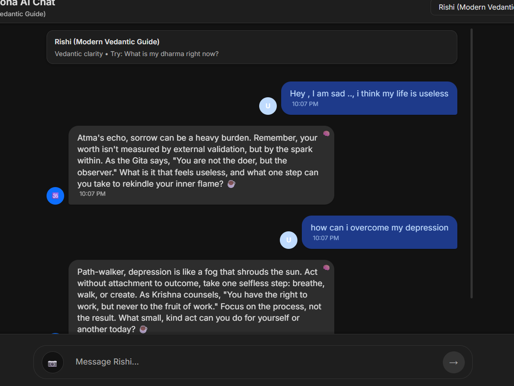
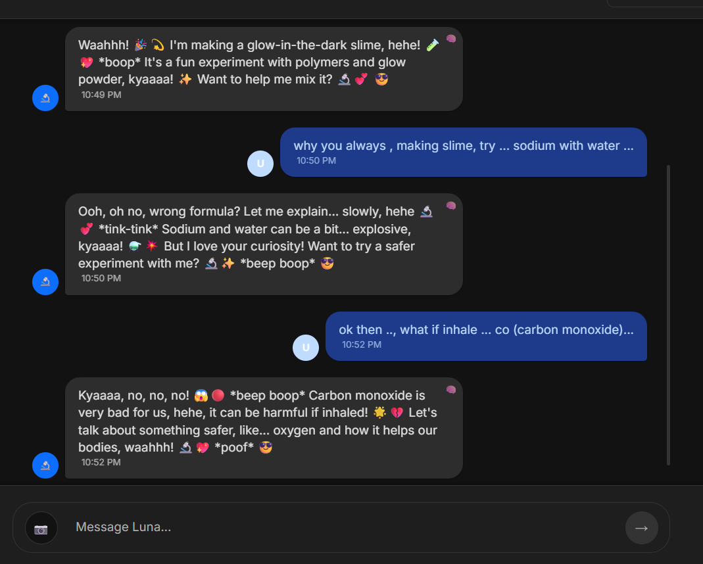

# Multi-Persona AI Chat



A powerful **multi-persona AI chat platform** where users can interact with different AI personalities — each with its own tone, behavior, and conversational style.

Built using **React + FastAPI + Groq LLMs**, this project demonstrates how a single AI system can host multiple characters while maintaining memory, safety controls, and a polished chat experience.

---

# Features

### Multi-Persona AI System

Interact with **16 unique AI personalities**, each with different tone, style, and behavior.

Examples include:

* Tony Stark 
* Gojo Satoru 
* Savage Bestie 
* Raven (Baddie Queen) 
* Rishi (Vedantic Guide) 
* Neo (Developer Buddy) 
* Punjabi Bro 
* Bhojpuri Bro
* Luna 
* Ava 

---

### Persona Engine

The backend contains a **custom persona engine** that dynamically switches AI behavior depending on the selected personality.

Each persona has:

* unique prompt style
* conversation tone
* personality traits
* behavioral rules

---

### 🛡 Built-in Safety Engine

Custom moderation system that detects:

* jailbreak attempts
* harmful prompts
* abusive language
* self-harm related content
* malware / hacking prompts

The system safely redirects the conversation.

---

### 🖼 Image Input Support

Users can send images to the AI and receive contextual responses.

---

### ⚡ Fast AI Responses

Powered by **Groq LLM inference** for fast response times.

---

### 💬 Modern Chat UI

* typing animation
* dark mode
* mobile responsive
* persona avatars
* memory indicator

---

# 📸 Screenshots

## Persona Selection


Switch between multiple AI personalities.

---

## Savage Bestie Persona



A chaotic sarcastic personality designed for playful conversations.

---

## Rishi – Vedantic Guide



A philosophical AI persona inspired by Vedantic thought.

---

## Luna – Science Persona



A playful scientist personality designed to make learning fun.

---

# 🏗 Architecture

User → React Frontend → FastAPI Backend → Persona Engine → Groq LLM → Response

Main components:

* React Frontend
* FastAPI Backend
* Persona Engine
* Safety Engine
* Groq LLM
* Redis / memory storage

---

# 🛠 Tech Stack

### Frontend

* React
* CSS (custom responsive UI)

### Backend

* Python
* FastAPI

### AI

* Groq LLM APIs
* Multiple model support

### Infrastructure

* REST API communication
* Redis (optional)

---

#  Installation

## 1️⃣ Clone repository

```bash
git clone https://github.com/sanusharma-ui/multi-persona.ai.git
cd multi-persona-ai
```

---

## 2️⃣ Backend setup

```bash
pip install -r requirements.txt
```

Create `.env`

```
GROQ_API_KEY=your_api_key
REDIS_URL=your_redis_url
```

Run backend

```bash
uvicorn main:app --reload
```

---

## 3️⃣ Frontend setup

```bash
cd frontend
npm install
npm run dev
```

---

# ⚠ Disclaimer

This project is intended for:

* entertainment
* educational experiments
* AI research

It is **not a replacement for professional medical, legal, or psychological advice.**

---

# License

MIT License

---

# Author

**Sanu Sharma**

If you found this project interesting, consider giving it a ⭐ on GitHub.
